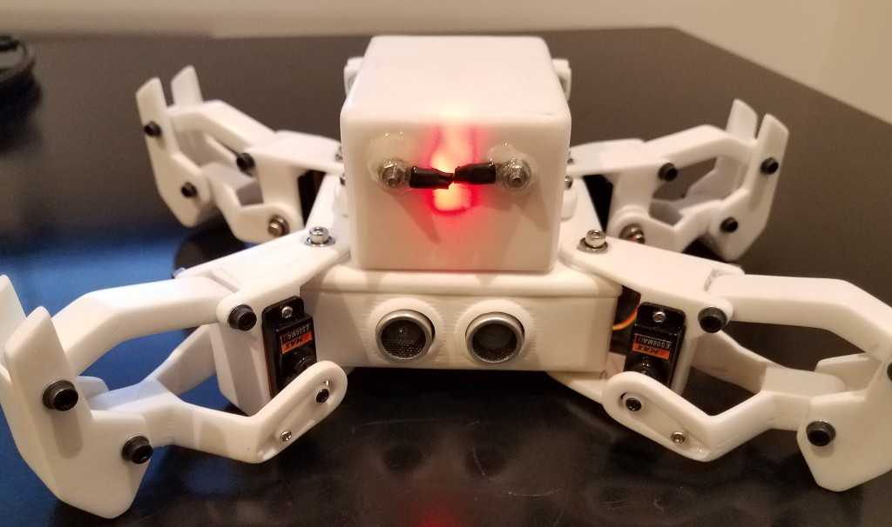
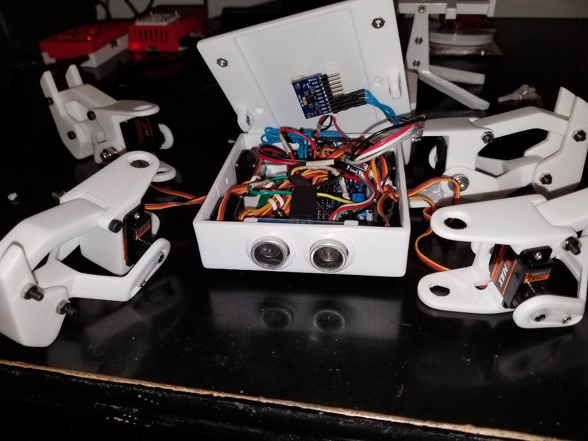
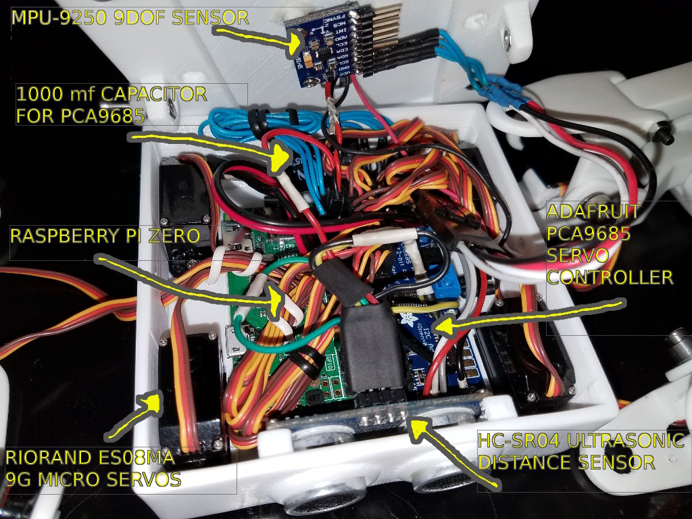
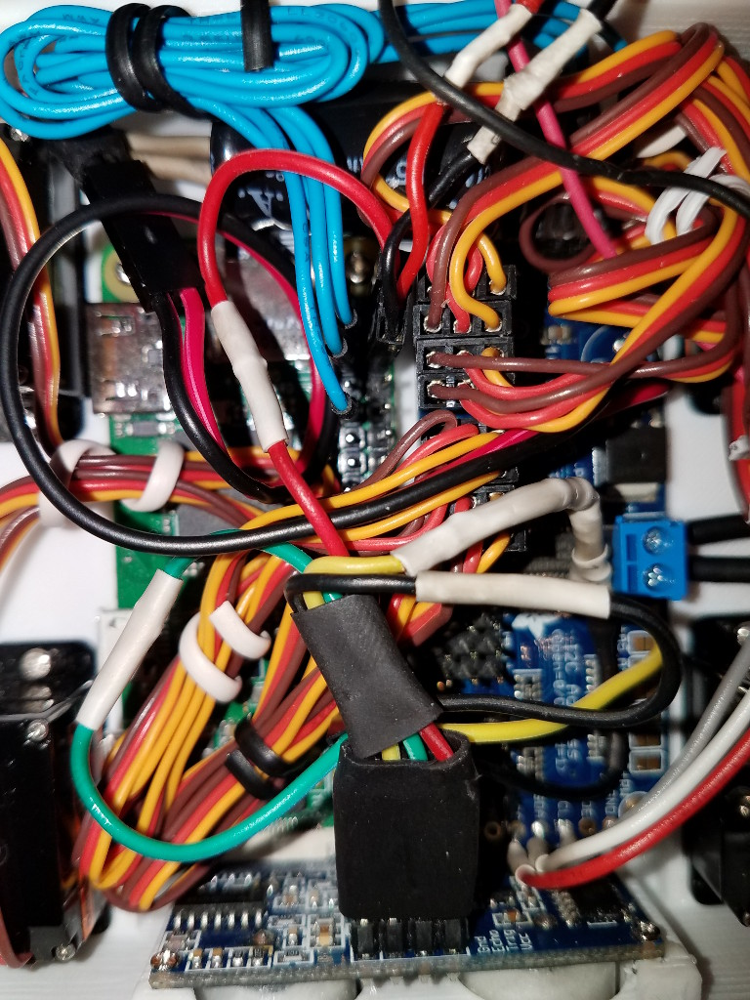

# Peabot

## Overview

This software controls a custom-built quadruped robot. Namely, this guy (or anyone like him):

## Software Features
* Full solution for controlling a quadruped robot.
* Includes many "motions" for moving the robot (walk, turn, extend arms, etc.).
* Interactive command prompt for sending the robot commands.
* RESTful web API for controlling the robot through HTTP requests.
* Multiple configuration options (config file, command line, interactive prompt).

## Planned Features
* Artificial intelligence.
* Sensor data management and automatic motion stabilization.
* Additional walk gates, and other movements.
* Front-end control application.
* Authentication and encryption of RESTful requests.

## Requirements.

Peabot is written to be run on any robot that can run c programs on its microprocessor. 
Likewise, out of the box, it is presumed that you will use the PCA-9685 PWM bus chip.
However, with minimal modifications, it should be capable of running on any hardware
that supports PWM servo control.

Peabot also assumes you are running the Raspbian operating system.

This software is written in such a way that if future contributers would like to use
more servos on their robots (for example a hexapod, etc.), then they may do so by
modifying it to their purposes and recompiling. In general, Peabot is a framework
for handling generic robotic functions; however, for quadrupeds with eight servos, 
it's an all-in-one solution. Simply install the application on any Raspberry Pi, 
and you'll have the ability to get your bot up and walking with minimal configuration.

## Mechanical Considerations

In a standard quadruped, each of the robot's four legs is moved by two separate 
micro 9G servos. That makes for a total of eight servos. Peabot's default 
animations presume that you will be using an eight-servo robot.

Typical hobby servos are able to rotate about 165 degrees, although 
physical joints of a robot may rotate somewhat less so. As such, you should be aware
that your robot may need to be configured such that servo motions can compensate for
such an offset.

## Electronic Components

The default target electronics for a Peabot robot are presumed to be as such:

### Raspberry Pi Zero
The central component of a Peabot robot is a Raspberry Pi, which is a 
fully functioning computer, configured to run the Raspbian operating system.

### Adafruit PCA9685 servo controller breakout
This controller is able to take I2C input from the Raspberry Pi's applicable 
pins, and multiplex that signal through 16 channels. In this case, the robot 
uses 8 of the controller's pins, 0-7, to control its 8 servos. 

*Note* A 1000mf capacitor should be soldered to PCA-9685 as indicated by 
the manufacturer in order to provide consistent power to the servos.

### RioRand ESO8MA 9G micro servos
These are the robot's source of mechanical movement, allowing for precise 
rotation of the robot's joints. Any 9g servos may be used, however.

### HC-SR04 ultrasonic distance sensor
In addition to serving as a neato robot face, this sensor detects the distance 
between itself and any obstructions directly in front of it using ultrasonic 
echos (like a bat). Use of the UDS is optional, and configurable.

### MPU-9250 9DOF sensor breakout
This sensor is able to capture gyroscopic rotation, magnetic bearing and 
acceleration of the robot. In future versions of the robot's software, the 
robot will be able to use this information to navigate on its own. Use of
this board is optional, and configurable.

## Example Wiring and Pins

You may assemble and connect the electronic components of the robot in the 
following way:

### Raspberry Pi GPIO Pins:

**GPIO 1** -> PCA9685 INPUT VCC

**GPIO 2** -> HC-SR04 VCC

**GPIO 3** -> PCA9685 INPUT SDA

**GPIO 4** -> 3.4V LIPO +

**GPIO 5** -> PCA9685 INPUT SCL

**GPIO 6** -> 3.4V LIPO -

**GPIO 9** -> PCA9685 INPUT GROUND

**GPIO 30** -> MPU-9250 GROUND

**GPIO 31** -> HC-SR04 ECHO

**GPIO 32** -> HC-SR04 TRIG

**GPIO 34** -> HC-SR04 GROUND

### PCA9685

***Note*** "Input" refers to the left-hand side of the breakout, when situated 
in a left-to-right orientation.

[INPUT SIDE]

**GND** -> RPI GPIO 9

**SCL** -> RPI GPIO 5

**SDA** -> RPI GPIO 3

**VCC** -> RPI GPIO 1

[OUTPUT SIDE]

**GND** -> MPU-9250 GND

**SCL** -> MPU-9250 SCL

**SDA** -> MPU-9250 SDA

**VCC** -> MPU-9250 VCC

[CHANNELS]

**0** - BACK LEFT KNEE SERVO

**1** - BACK LEFT HIP SERVO

**2** - FRONT LEFT HIP SERVO

**3** - FRONT LEFT KNEE SERVO

**4** - BACK RIGHT KNEE SERVO

**5** - BACK RIGHT HIP SERVO

**6** - FRONT RIGHT KNEE SERVO

**7** - FRONT RIGHT HIP SERVO

### MPU-9250

**GND** -> PCA9685 OUTPUT GND

**SCL** -> PCA9685 OUTPUT SCL

**SDA** -> PCA9685 OUTPUT SDA

**VCC** -> PCA9685 OUTPUT VCC
 
### HC-SR04

**VCC** -> RPI GPIO 2

**ECHO** -> RPI GPIO 32 (WiringPi 26)

**TRIG** -> RPI GPIO 31 (WiringPi 22) 

**GROUND** -> RPI GPIO 34

## Power

A Peabot robot should use two separate power sources to do its work. The Raspberry Pi Zero, 
the PCA-9685 (I2C-side), the HC-SR04 and the MPU-9250 may be run from a rechargable 3.4v 
lipo battery, while the servos may be powered from two 18650 batteries, connected 
in series, for about 8v. This may be reduced through a Hobbywing 5V/6V 3A 
switch-mode UBEC (or similar), and wired into the PCA-9586's screw terminals. 

Optionally, you have an Adafruit MCP73833 lipo charger installed into the battery pack 
itself, which may recharge the 3.4v battery inline. The 18650 batteries 
should be removed and recharged in a separate battery charging device.

## 3D Printed Parts

Recommended legs for a Peabot robot are from Javier Isabel's Kame robot, which is available 
on Thingiverse.com:

http://www.thingiverse.com/thing:1265766

The STL models for a body, top and battery compartment which I had customized 
for this robot are included in the 3d_models directory of this repository for 3D printing. 
Recommended print settings are around .3mm layer height, with temps as per your 
material of choice.

The battery holder model includes customized support structures, which may be 
removed after printing.

## Required Packages

It is presumed that you will be using the Raspbian operating system on your
Raspberry Pi.

This software requires that two packages are installed:

**WiringPi** http://wiringpi.com/download-and-install/

**Reinbert/pca9685** https://github.com/Reinbert/pca9685

Instructions for installing those packages are available via their respective 
links.

## Log Files

Log files are stored in `/var/log/peabot` on your system by default. This directory may
be configured via the application's configuration file. Options are also
available in the configuration file to log only the information in which you are
most interested.

## Installation

To install Peabot, clone this repository to any directory of your Raspberry Pi
(i.e. /opt/peabot). Run `make` then `make install` (as root or sudo) from 
the command line from within the directory of the repository.

To uninstall, type `make full-uninstall` (as root or sudo). This will remove Peabot from your 
system, while keeping log files in `/var/log/peabot`.

Peabot must be run with permissions to access the Raspberry Pi's GPIO; use `sudo` to
run peabot if your user does not have permissions to the Raspberry Pi's GPIO.

The command `peabot` may be run after installation to start the program (e.g. `sudo peabot`).

## Command Prompt

If you run Peabot manually from the command line (by typing `peabot`) you
will see a command prompt, from which you may send commands directly to the 
robot. 

The following commands are available:

### walk [#times[ex: 3]] [halftime [ex: 1.0]]

Execute `#times` iterations of the walk cycle, with each cycle lasting 
(`halftime` * 2) seconds long.

### elevate [time [ex: 5.3]] [reverse [ex: 0 or 1]]

Execute the robot's "elevate" motion, which fully extends or retracts its knees 
(defined by the `reverse` param). Lasts a total of `time` seconds.

### extend [time [ex:3.7]] [reverse [ex: 0 or1]]

Extends the robot's "hip" servos to either their fully extended or fully
retracted position. Last a total of `time` seconds.

### reset

Reset all servos to their "home" position.

### halt

Halt the robot entirely.

### quit

Quit the application and shut down the robot.

## Command Line Options

Various command line options can be set when running the Peabot application. The
following is a list of those options, their format and what they do.

### `-c` or `--config` [path to config]

Allows the user to specify the path of a configuration file to use.

### `--log_stdin`

If present, log all raw standard-in input from the application's prompt.

### `--log_prompt`

If present, log all command prompt activity.

###  `--log_event_add`

If present, log all system events as they are added to the application's queue.

### `--log_event_callback`

If present, log all callbacks, which occur when an event is executed.

### `--log_keyframes`

If present, log when keyframes have been executed.

### `--pca-9685-hertz` [integer]

Set the PCA-9685's signal frequency.

### `--pca-9685-pin-base` [integer]

Set the PCA-9685's pin base.

### `--pca-9685-max-pwm` [integer]

Set the PCA-9685's maximum PWM value.

### `-s` or `--servos` [integer]

Set the number of servos used by the robot.

### `-t` or `--servo_tick` [decimal number]

Set the robot's update function to the val (which represents seconds).

### `--transitions-enable`

If present, enable automatic transitions between keyframes.

### `--transitions-time` [decimal number]

The amount of time in seconds to allocate for transition keyframes.

### `--walk-hip-delta` [decimal number]

The magnitude of servo position change for hips during the walk animation.

### `--walk-knee-delta` [decimal number]

The magnitude of servo position change for knees during the walk animation.

### `--walk-knee-pad-a` [decimal number]

The percentage of the walk animation where its initial knee movement is delayed.

### `--walk-knee-pad-b` [decimal number]

The percentage of the walk animation where its second knee movement is delayed.

## Config File

As explained above, if the user specifies the `-c` or `--config` option via
the command line when the application is run, then the Peabot application will
load the file at the provided path in order to determine its initial settings.

A config file uses `#` to indicate that a line is a comment, and ignores empty
lines. Options are set in a key-value format, wherein each [KEY] is followed
by a [VALUE]; extra spaces between [KEY] and [VALUE] are ignored.

The following options are available to be set via a configuration file:

### `log_file_dir` [path]

The directory in which to store log files.

### `log_stdin` [true|false]

Whether or not to log raw standard-in input.

### `log_prompt_commands` [true|false]

Whether or not to log prompt activity.

### `log_event_add` [true|false]

Whether or not to log when events are added to the application's event queue.

### `log_event_callbacks` [true|false]

Whether or not to log event callback functions when an event is acted upon.

### `log_keyframes` [true|false]

Whether or not to log keyframes after they have been executed.

### `pca_9685_pin_base` [integer]

Set the PCA-9685's pin base.

### `pca_9685_max_pwm` [integer]

Set the PCA-9685's maximum PWM value.

### `pca_9685_hertz` [integer]

Set the PCA-9685's signal frequency.

### `servos_num` [integer]

Set the total number of servos in use on the robot.

### `robot_tick` [decimal number]

Set the time in seconds to use for the robot's update function.

### `transitions_enable` [true|false]

Whether or not to enable transition motions between differing keyframes.

### `transition_time` [decimal number]

The time in seconds to use for each transition animation.

### `walk_hip_delta` [decimal number]

Set the robot's hip change magnitude during the walk animation.

### `walk_knee_delta` [decimal number]

Set the robot's knee change magnitude during the walk animation.

### `walk_knee_pad_a` [decimal number]

Set the percentage of the robot's walk animation during which the initial knee 
motion is delayed.

### `walk_knee_pad_b` [decimal number]

Set the percentage of the robot's walk animation during which the second knee 
motion is delayed.

### `back_left_knee` [integer]
### `back_left_hip` [integer]
### `front_left_knee` [integer]
### `front_left_hip` [integer]
### `back_right_knee` [integer]
### `back_right_hip` [integer]
### `front_right_knee` [integer]
### `front_right_hip` [integer]

Set the position [0-16] on the PCA-9685 for each servo position.

### `back_left_knee_limits` [min-max]
### `back_left_hip_limits` [min-max]
### `front_left_knee_limits` [min-max]
### `front_left_hip_limits` [min-max]
### `back_right_knee_limits` [min-max]
### `back_right_hip_limits` [min-max]
### `front_right_knee_limits` [min-max]
### `front_right_hip_limits` [min-max]

Set the minimum and maximum PWM values to set for the individual
servos. These settings are very useful for calibrating your robot,
especially if you were unable to perfectly center your servos
when installing them onto your robot. Caution should be used such
that these PWM values do not exceed the physical limitations of the
robot.

## RESTful Web Service

Peabot provides a RESTful HTTP service on the port specified on the configuration file,
if HTTP_ENABLED is set to true.

The RESTful service may be used to send commands to the robot via HTTP, or to retrieve
data from the robot.

Typical RESTful requests made to Peabot are either general GET requests for retrieve
information or POST requests with JSON data in the request body to specify command
paramters. The format of specific RESTful requests is as follows:

### POST /event/walk

JSON
`
{
    "cycles": 10,
    "duration": 1.54,
    "reverse": true
}
`

### POST /event/turn

### POST /event/elevate

### POST /event/extend

### POST /event/reset

No data required.

### POST /event/halt

No data required.